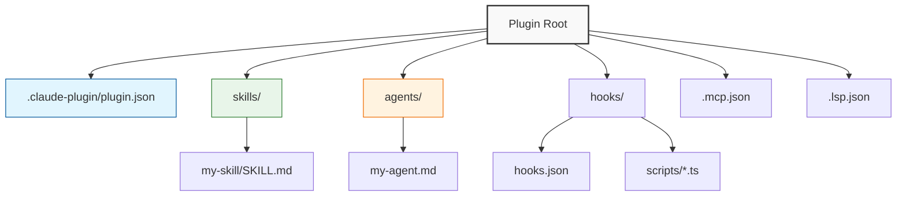

<div align="center">
  

  # Claude Code Plugin Template

  [](https://opensource.org/licenses/MIT)
  [](https://docs.claude.com)
  [](https://www.typescriptlang.org/)

  [English](./README.md) | [简体中文](./README_zh-CN.md)

  <p>
    A comprehensive template for building <a href="https://docs.claude.com/en/docs/claude-code/overview">Claude Code</a> plugins.<br/>
    Standard structure for Skills, Agents, Hooks, MCP & LSP.
  </p>
</div>

<br/>

## ⚡ Quick Start

### 1. Create your plugin
```bash
# Clone this template
git clone https://github.com/your-username/my-plugin.git
cd my-plugin

# Install dependencies (for TypeScript hooks/scripts)
npm install

# Make scripts executable
npm run prepare
```

### 2. Develop and Test
Test your plugin instantly in your current session:
```bash
claude --plugin-dir .
```

### 3. Verify
Check for configuration errors:
```bash
claude plugin validate
```

---

## 🏗️ Project Structure

This template follows the [Standard Plugin Layout](https://code.claude.com/docs/en/plugins-reference#plugin-directory-structure).



---

## 🧩 Components

### 🧠 Skills (`skills/`)
Reusable workflows invoked automatically or via `/slash-command`.
- **Path**: `skills/<name>/SKILL.md`
- **Tip**: Keep them focused on a single capability.

### 🤖 Agents (`agents/`)
Specialized sub-agents for complex, multi-step tasks.
- **Path**: `agents/<name>.md`
- **Config**: YAML frontmatter + System Prompt.

### 🪝 Hooks (`hooks/`)
Event-driven automation (e.g., `SessionStart`, `PreToolUse`).
- **Config**: `hooks/hooks.json`
- **Scripting**: Use `${CLAUDE_PLUGIN_ROOT}` for paths.

### 🔌 Connectivity
- **MCP Servers** (`.mcp.json`): Connect external tools & APIs.
- **LSP Servers** (`.lsp.json`): Add language intelligence.

---

## 🛠️ Configuration

**Plugin Manifest** (`.claude-plugin/plugin.json`)
```json
{
  "name": "my-plugin",
  "version": "0.1.0",
  "description": "My awesome plugin",
  "skills": "./skills/",
  "agents": "./agents/",
  "hooks": "./hooks/hooks.json"
}
```

---

## 📦 Distribution

1. **Commit** your changes.
2. **Update** `.claude-plugin/marketplace.json`.
3. **Install**:
   ```bash
   claude plugin install <plugin-name>@<marketplace-url>
   ```

## 🔍 Troubleshooting

| Issue | Solution |
|-------|----------|
| **Plugin not loading** | Run `claude --debug` to see logs |
| **Command fails** | `chmod +x` your scripts |
| **Path errors** | Use `${CLAUDE_PLUGIN_ROOT}` env var |


