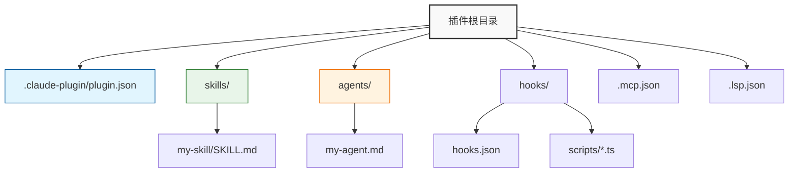

<div align="center">
  

  # Claude Code 插件模板

  [](https://opensource.org/licenses/MIT)
  [](https://docs.claude.com)
  [](https://www.typescriptlang.org/)

  [English](./README.md) | [简体中文](./README_zh-CN.md)

  <p>
    用于构建 <a href="https://docs.claude.com/en/docs/claude-code/overview">Claude Code</a> 插件的综合模板。<br/>
    包含 Skills、Agents、Hooks、MCP 和 LSP 的标准结构。
  </p>
</div>

<br/>

## ⚡ 快速开始

### 1. 创建你的插件
```bash
# 克隆此模板
git clone https://github.com/your-username/my-plugin.git
cd my-plugin

# 安装依赖 (用于 TypeScript hooks/脚本)
npm install

# 使脚本可执行
npm run prepare
```

### 2. 开发与测试
在当前会话中直接加载测试：
```bash
claude --plugin-dir .
```

### 3. 验证
检查配置是否正确：
```bash
claude plugin validate
```

---

## 🏗️ 项目结构

本模板遵循 [标准插件布局](https://code.claude.com/docs/en/plugins-reference#plugin-directory-structure)。



---

## 🧩 组件说明

### 🧠 Skills (`skills/`)
可重用的工作流，支持自动调用或通过 `/指令` 调用。
- **路径**: `skills/<name>/SKILL.md`
- **建议**: 每个 Skill 专注于单一能力。

### 🤖 Agents (`agents/`)
用于处理复杂多步骤任务的专用子代理。
- **路径**: `agents/<name>.md`
- **配置**: 使用 Markdown frontmatter 定义。

### 🪝 Hooks (`hooks/`)
事件驱动的自动化脚本 (如 `SessionStart`, `PostToolUse`)。
- **配置**: `hooks/hooks.json`
- **脚本**: 务必使用 `${CLAUDE_PLUGIN_ROOT}` 环境变量。

### 🔌 连接性
- **MCP 服务器** (`.mcp.json`): 连接外部工具和 API。
- **LSP 服务器** (`.lsp.json`): 添加代码智能感知。

---

## 🛠️ 配置指南

**插件清单** (`.claude-plugin/plugin.json`)
```json
{
  "name": "my-plugin",
  "version": "0.1.0",
  "description": "我的超棒插件",
  "skills": "./skills/",
  "agents": "./agents/",
  "hooks": "./hooks/hooks.json"
}
```

---

## 📦 分发

1. **提交** 你的代码更改。
2. **更新** `.claude-plugin/marketplace.json`。
3. **安装**:
   ```bash
   claude plugin install <plugin-name>@<marketplace-url>
   ```

## 🔍 故障排除

| 问题 | 解决方案 |
|-------|----------|
| **插件未加载** | 运行 `claude --debug` 查看日志 |
| **命令失败** | 运行 `chmod +x` 赋予脚本执行权限 |
| **路径错误** | 确保使用了 `${CLAUDE_PLUGIN_ROOT}` 变量 |


